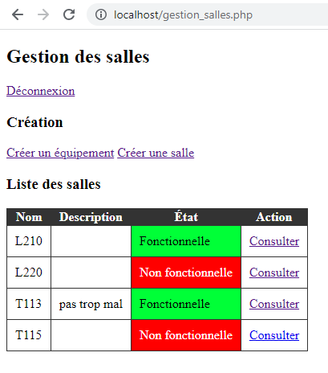

# Linit
Linit, qui est l'accronyme récursif anglophone de "Linit Is Not an Inventary Tool", est un outil très simple pour répertorier l'état de salles de classes et de leurs équipements.

L'outil fonctionne sur un serveur web avec PHP et une base de donnée SQL.
Le projet en est à ses débuts et se veut surtout fonctionnel.
